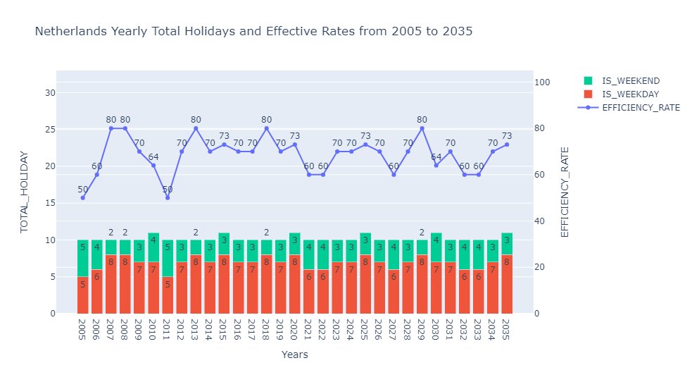
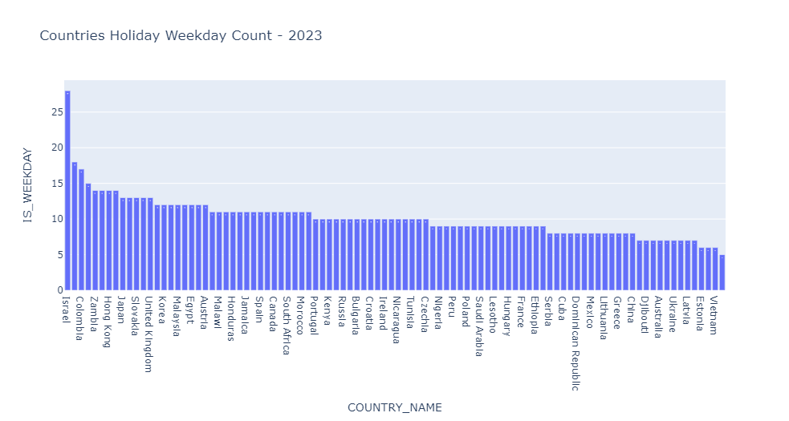
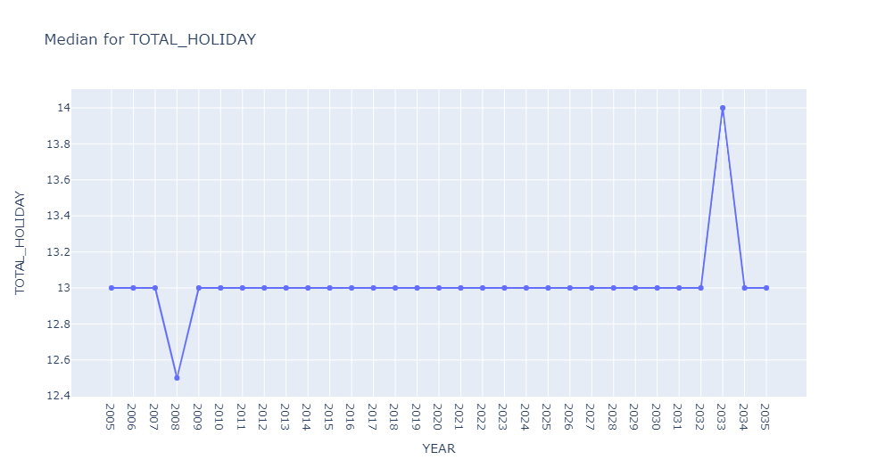

# CountriesHoliday

In this analysis, you can find countries Holidays information by using the Python Holiday library. 

```python
import pandas as pd
import holidays

#Getting holidays by using the holidays library to a dictionary 
holidays_dict = holidays.country_holidays(country_code,years=range(start_year,end_year+1,1))
```

The [https://github.com/merteygi/EqiupmentInfoExe/blob/main/main.py](https://github.com/merteygi/CountriesHoliday/blob/main/Holidays.ipynb) file shows the souce codes that I wrote. You can extend your analysis by using it. 


## Notes
* If the Holiday corresponds from Monday to Friday, 'IS_WEEKDAY' is 1 otherwise 0. 
* If the Holiday corresponds from Monday to Friday, 'IS_WEEKEND' is 0 otherwise 1. 
* Efficency is the rate of total number of 'IS_WEEKDAY' divided by total number of 'TOTAL_HOLIDAY' within the desired period. 

## Netherlands

## Germany

## Türkiye





